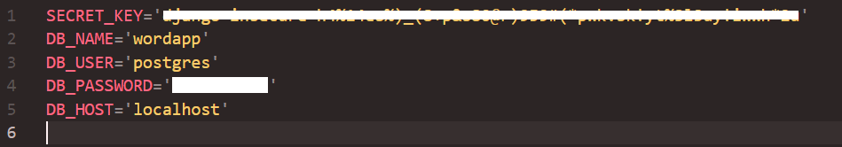
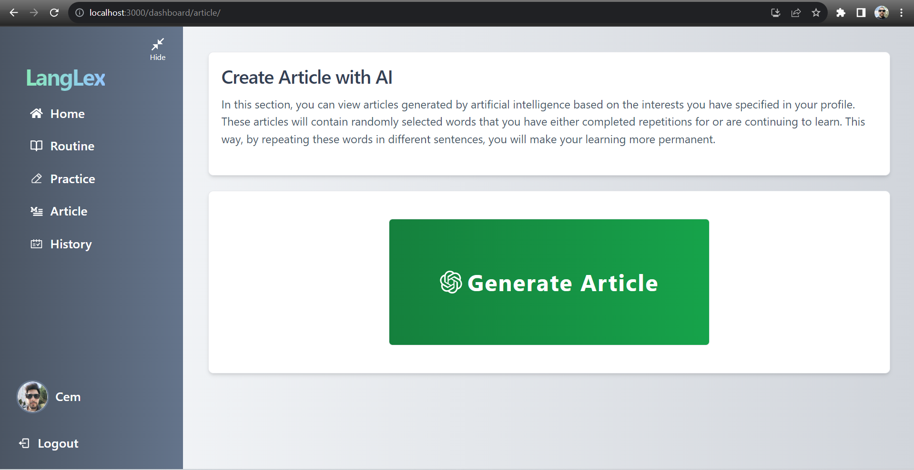

# Word Learning App Created with Django REST Framework, ReactJS, PostgreSQL and TailwindCSS

In this application, Django REST Framework is used on the backend, PostgreSQL is used on the databes, while ReactJS is used on the frontend. The application's design is built with TailwindCSS.

## Purpose of the Application

This application provides a simple and effective way for people who want to learn new words in a new language to speak the language more comfortably.

* Users can save the words they want to learn and two different sentences associated with each word. While saving, they specify how many times they want to repeat these sentences in total.

* Users can review the words they have saved on previous days, repeating them daily until they reach the specified repetition count.

* Users can also choose to read articles generated using the ChatGPT API. The main topic of these articles will be one of the user's selected interests when creating their profile. Additionally, 10 of the words previously added to the database for learning purposes will be randomly included in the article. This way, users will encounter the words they want to learn frequently, making the learning experience more lasting.

## Running the Application Local Host

#### Step 1: Clone this repository to your computer.
` git clone https://github.com/savascem/LangLex-app.git `

#### Step 2: Go backend file and install dependencies and run django
` cd backend `

` pip install requirements.txt `

##### 2.1: DataBase Settings
* In this project, PostgreSQL is used as the database. If you do not wish to use PostgreSQL, create a file named 'db.sqlite3' with that extension inside the 'backend' folder. Then, navigate to the 'backend/project/settings.py' file and, as shown in the image below, comment out the PostgreSQL section and uncomment the SQLite3 section.

* If you want to use PostgreSQL, you have to create a database in PostgreSQL (pgAdmin4). Afte create a file named '.env' in the backend folder. The .env file should like:

If you finished DB settings, runserver:

` python manage.py runserver `

#### Step 3: Go frontend file and install dependencies and running react
` cd frontend `

` npm install `

` npm start `

##### 3.1: Chat GPT API settings
In this project, I utilized the GPT API from RapidAPI. The GPT API allows up to 10 free requests per day. Please follow the link 'https://rapidapi.com/haxednet/api/chatgpt-api8/' to activate the API. Afterward, create a '.env' file inside the 'frontend' folder with the following format:

#### Step 4: Access the APP

Visit http://localhost:3000/ in your browser and start using the application.

## How it Looks?

* Home Page (No Authenticated)

* Register & Footer
  

* Login
  

* Dashboard Home

* Routine

* Routine Update

* Practice

* Article

* History

* Profile

